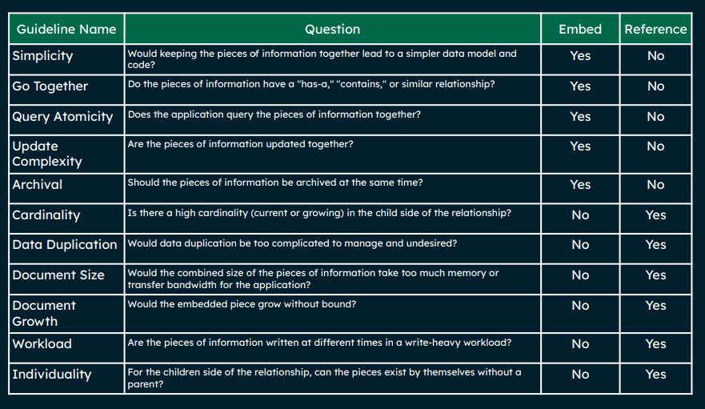

# Data Modeling

## 3 Main Questions
1. Can entity A be related to more than 1 entity B?
2. Can entity B be related to more than 1 entity A?

if all no... 1-1
if one yes... 1-many
if two yes... many-many

## Deciding upon using referencing or embedding?

Reference:
- Seperate documents linked using a key
- Usually coming from different collections

REMEMBER: Data that is accessed together should be stored together

## One to One relationship
e.g. country and country code
e.g. publisher and HQ

## One / Many to Many relationship
Can embed or reference.
